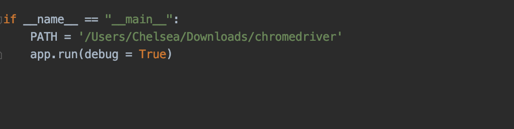
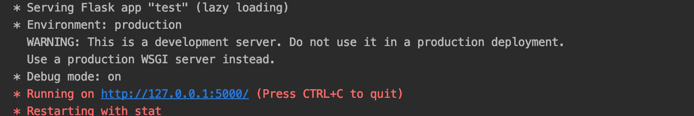
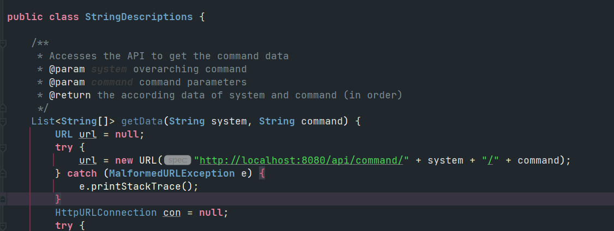

# CSE3910- Individual Project

**Guided Social Media Application**
by Chelsea Chen & Christie Leung

# Overview
This application consists of three parts: web-application, discord bot, and a Rest API where a MySQL Database can be assessed. 

The following is needed in order to run this application:
- Python 2.7
    - Selenium
    - NumPy
    - flask
    - requests
- Chrome & chromedriver (please ensure that the version matches on both ends)
    - chromedriver download link: https://chromedriver.chromium.org/downloads
- Java  11
- MySQL database
- Postman can be used for accessing / writing to the database

1. The user must first **run the Python application (main.py)** in which acts as the web application, showing all steps in using discord. 

2. Then, the user will be prompted to **join a discord server** which holds the bot application that provides available guides for internal discord features.

# Web Application (Python)
The web application uses selenium, numpy and flask to build a website along with chromedriver. It scrapes the data from the original discord website (https://discord.com/). This application runs best on macOS. 

Before running the program, ensure that the database has already been set up and is functional.

When running the main.py file, you must change the PATH variable to the executable path to your chromedriver that you have had downloaded. 

After entering the executable path, it will prompt a link. Please copy and paste the link into google chrome to run the application. 

# Discord Bot (Java)
The discord bot provides guides on internal discord functions through commands. It gets its data from the Rest API which stores all the images and instructions in a MySQL database. 

To run the discord bot, you must have a discord account and register for a bot application (https://discord.com/login?redirect_to=%2Fdevelopers%2Fapplications) 

In the **Private.java** file, you must change the bot token and owner ID to fit yours.

In **StringDescriptions.java**, you may want to change the address of the request depending on where the database is running.

After that, run the `BotApplication.java` file.

## Functions
When you have invited the bot onto a server or joined a server with this bot, you can use the command *!help* to see all guides available. 

**Available commands:**
!friend add
!friend message
!friend block
!friend accept
!friend remove
!settings language
!settings sound
!settings appearance

# Rest API & MySQL Database
The Rest API uses java and spring boot. To run the program, go into the *application.properties* file and change the datasource to the address you are running the MySQL server on:

`jdbc:mysql://**your_address_here**:3306/**database_name**?useSSL=false`

You will also have to change the username and password to fit your own settings.

To run the MySQL database, you must install mysql. Once configured, you can type in `mysql` in terminal to access mysql. To create a database, type in `CREATE DATABASE your_database_name;`

The information for the data is already in the program code. However, to update or change the file, you can download postman to POST the updated information:

The full data can be found here: https://docs.google.com/spreadsheets/d/1BLZmQvOhcA2PxyjseBj8E5dHTtntHksSuH8ucfhEiGU/edit?usp=sharing

After that, run the `DatabaseApplication.java` file.

